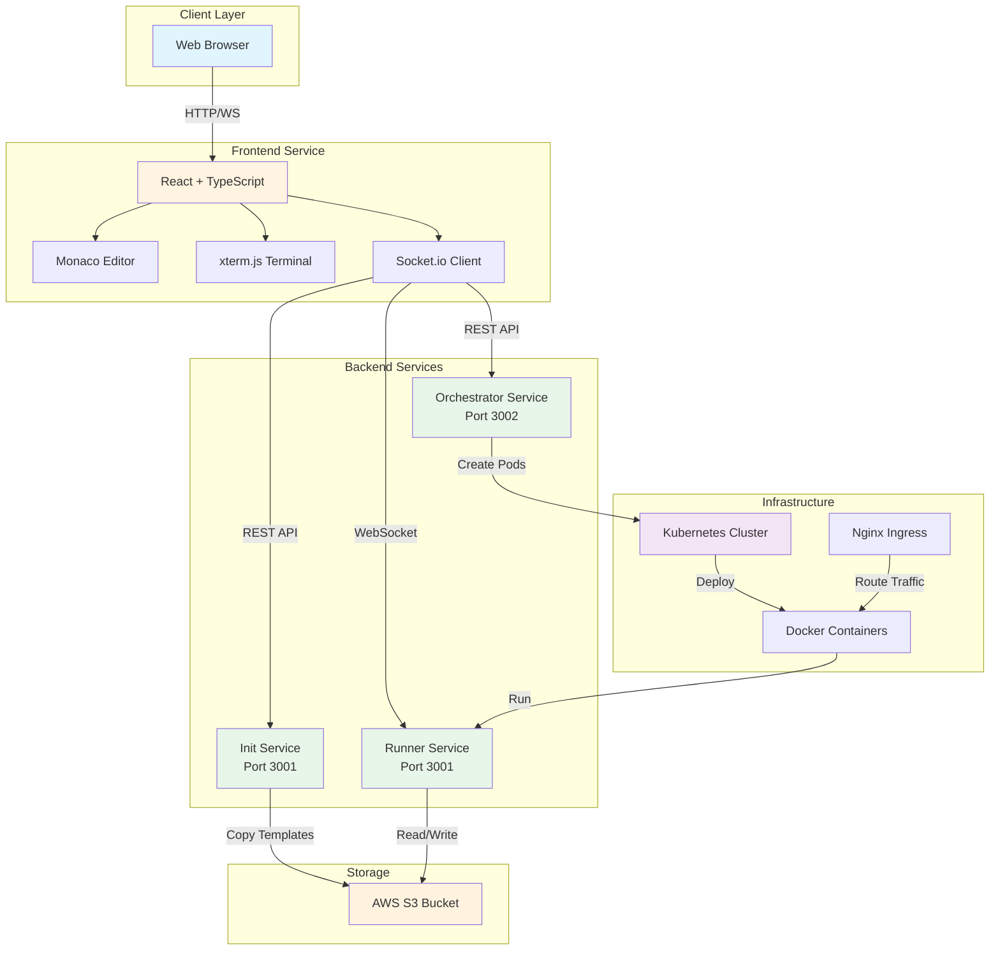
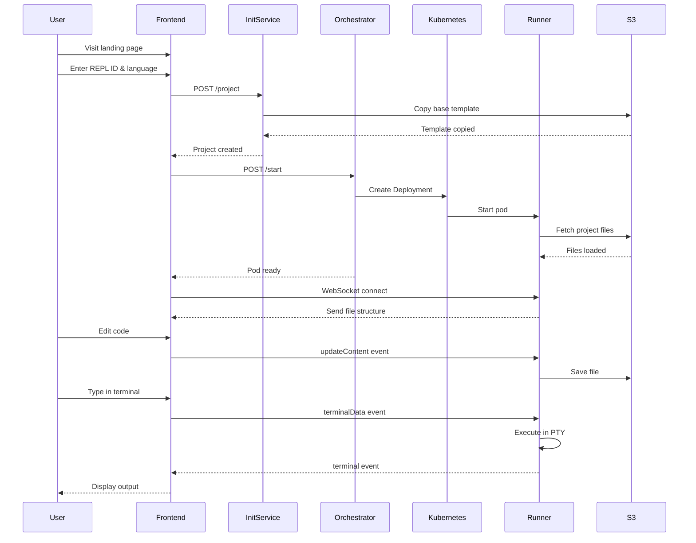

# Cloud-Based REPL Platform 🚀

> A  cloud-native online code editor and execution platform built with microservices architecture, enabling isolated coding environments with real-time collaboration.


## 🎯 Overview

This is a **cloud-native REPL (Read-Eval-Print Loop) platform** similar to Replit, CodeSandbox, or GitHub Codespaces. It allows developers to:

- Create isolated coding environments in seconds
- Write and execute code in a browser-based IDE
- Access a full interactive terminal
- Collaborate in real-time
- Persist code to cloud storage automatically

The platform uses **Kubernetes** for dynamic container orchestration, **AWS S3** for persistent storage, and **WebSocket** for real-time bidirectional communication.

---

## ✨ Features

### 🎨 **Frontend Features**
- **Monaco Editor** - Full VS Code editing experience with syntax highlighting
- **Interactive Terminal** - Real-time bash terminal using xterm.js
- **File Explorer** - Browse and manage project files
- **Multi-language Support** - Node.js and Python environments
- **Auto-save** - Debounced automatic saving to cloud storage
- **Real-time Sync** - Live code synchronization across sessions

### ⚙️ **Backend Features**
- **Dynamic Container Orchestration** - On-demand Kubernetes pod provisioning
- **Isolated Execution Environments** - Secure sandboxed containers per user
- **WebSocket Communication** - Real-time bidirectional data flow
- **Persistent Storage** - AWS S3 integration for code backup
- **Resource Management** - CPU and memory limits per container
- **Template System** - Pre-configured project templates

### 🔒 **Infrastructure Features**
- **Kubernetes Native** - Scalable container orchestration
- **Docker Containerization** - Consistent runtime environments
- **Nginx Ingress** - Subdomain-based routing per REPL instance
- **Cloud Storage** - S3-backed persistent file system
- **Multi-tenancy** - Isolated environments for concurrent users

---

## 🏗️ Architecture

### System Architecture Diagram



### Microservices Overview

| Service | Technology | Port | Purpose |
|---------|-----------|------|---------|
| **Frontend** | React + Vite + TypeScript | 5173 | User interface with code editor and terminal |
| **Init Service** | Express + TypeScript | 3001 | Project initialization and S3 template cloning |
| **Orchestrator** | Express + Kubernetes API | 3002 | Dynamic pod creation and management |
| **Runner** | Express + Socket.io + node-pty | 3001 | Code execution, terminal, and file operations |

---

## 🛠️ Technology Stack

### **Frontend**
```json
{
  "framework": "React 18",
  "language": "TypeScript",
  "build_tool": "Vite",
  "editor": "Monaco Editor (@monaco-editor/react)",
  "terminal": "xterm.js + xterm-addon-fit",
  "communication": "Socket.io-client, Axios",
  "styling": "Emotion (CSS-in-JS)",
  "routing": "React Router DOM"
}
```

### **Backend**
```json
{
  "runtime": "Node.js 20",
  "framework": "Express",
  "language": "TypeScript",
  "websocket": "Socket.io",
  "cloud_sdk": "AWS SDK (S3)",
  "orchestration": "@kubernetes/client-node",
  "terminal": "node-pty",
  "config": "dotenv",
  "parsing": "yaml"
}
```

### **Infrastructure**
```json
{
  "container_runtime": "Docker",
  "orchestration": "Kubernetes",
  "ingress": "Nginx Ingress Controller",
  "storage": "AWS S3",
  "deployment": "Kubernetes Deployments, Services, Ingress"
}
```

---

## 📦 Prerequisites

Before you begin, ensure you have the following installed:

- **Node.js** >= 18.x ([Download](https://nodejs.org/))
- **npm** or **yarn** package manager
- **Docker** ([Download](https://www.docker.com/))
- **Kubernetes** cluster (Minikube, Kind, or cloud provider)
- **kubectl** CLI ([Install](https://kubernetes.io/docs/tasks/tools/))
- **AWS Account** with S3 access
- **AWS CLI** configured ([Setup](https://aws.amazon.com/cli/))

### Verify Installation

```bash
node --version    # Should be >= 18.x
npm --version     # Should be >= 9.x
docker --version  # Should be >= 20.x
kubectl version   # Should connect to cluster
aws --version     # Should be configured
```

---

## 🚀 Installation

### 1. Clone the Repository

```bash
git clone <repository-url>
cd good-code
```

### 2. Install Dependencies for All Services

```bash
# Frontend
cd frontend
npm install
cd ..

# Init Service
cd init-service
npm install
cd ..

# Orchestrator Service
cd orchestrator-simple
npm install
cd ..

# Runner Service
cd runner
npm install
cd ..
```

---

## ⚙️ Configuration

### 1. AWS S3 Setup

Create an S3 bucket and prepare base templates:

```bash
# Create S3 bucket
aws s3 mb s3://repl

# Upload base templates
aws s3 cp ./base/node-js s3://repl/base/node-js --recursive
aws s3 cp ./base/python s3://repl/base/python --recursive
```

### 2. Environment Variables

Create `.env` files for each service:

#### **Init Service** (`init-service/.env`)
```env
PORT=3001
AWS_ACCESS_KEY_ID=your_access_key
AWS_SECRET_ACCESS_KEY=your_secret_key
S3_ENDPOINT=https://s3.amazonaws.com
S3_BUCKET=repl
```

#### **Orchestrator Service** (`orchestrator-simple/.env`)
```env
PORT=3002
AWS_ACCESS_KEY_ID=your_access_key
AWS_SECRET_ACCESS_KEY=your_secret_key
S3_ENDPOINT=https://s3.amazonaws.com
S3_BUCKET=repl
```

#### **Runner Service** (`runner/.env`)
```env
PORT=3001
AWS_ACCESS_KEY_ID=your_access_key
AWS_SECRET_ACCESS_KEY=your_secret_key
S3_ENDPOINT=https://s3.amazonaws.com
S3_BUCKET=repl
```

### 3. Kubernetes Configuration

Update `orchestrator-simple/service.yaml` with your AWS credentials:

```yaml
env:
  - name: AWS_ACCESS_KEY_ID
    value: "your_aws_key_id"
  - name: AWS_SECRET_ACCESS_KEY
    value: "your_aws_secret"
```

### 4. Build Runner Docker Image

```bash
cd runner
docker build -t 100xdevs/runner:latest .
docker push 100xdevs/runner:latest  # Push to your registry
cd ..
```

### 5. Install Nginx Ingress Controller

```bash
kubectl apply -f k8s/ingress-controller.yaml
```

---

## 🎮 Running the Application

### Development Mode

Run each service in separate terminals:

```bash
# Terminal 1 - Frontend
cd frontend
npm run dev
# Runs on http://localhost:5173

# Terminal 2 - Init Service
cd init-service
npm run dev
# Runs on http://localhost:3001

# Terminal 3 - Orchestrator Service
cd orchestrator-simple
npm run dev
# Runs on http://localhost:3002

# Terminal 4 - Runner Service (for local testing)
cd runner
npm run dev
# Runs on http://localhost:3001
```

### Production Mode

```bash
# Build all services
cd frontend && npm run build && cd ..
cd init-service && npm run build && cd ..
cd orchestrator-simple && npm run build && cd ..
cd runner && npm run build && cd ..

# Start services
cd init-service && npm start &
cd orchestrator-simple && npm start &
```


### Runner Service WebSocket Events

#### **Client → Server Events**

| Event | Payload | Description |
|-------|---------|-------------|
| `fetchDir` | `dir: string` | Fetch directory contents |
| `fetchContent` | `{ path: string }` | Fetch file content |
| `updateContent` | `{ path: string, content: string }` | Save file content |
| `requestTerminal` | - | Initialize terminal session |
| `terminalData` | `{ data: string }` | Send terminal input |

#### **Server → Client Events**

| Event | Payload | Description |
|-------|---------|-------------|
| `loaded` | `{ rootContent: RemoteFile[] }` | Initial file structure |
| `terminal` | `{ data: Buffer }` | Terminal output |

**Example WebSocket Connection:**
```typescript
import { io } from 'socket.io-client';

const socket = io(`ws://my-project.peetcode.com`);

socket.on('loaded', ({ rootContent }) => {
  console.log('Files loaded:', rootContent);
});

socket.emit('fetchContent', { path: '/index.js' }, (content) => {
  console.log('File content:', content);
});
```

---

## 🚢 Deployment

### Kubernetes Deployment

1. **Apply Ingress Controller:**
```bash
kubectl apply -f k8s/ingress-controller.yaml
```

2. **Deploy a REPL Instance:**
```bash
# The orchestrator service automatically creates these resources
# when you call POST /start

# Manually deploy (for testing):
kubectl apply -f orchestrator-simple/service.yaml
```

3. **Verify Deployment:**
```bash
kubectl get deployments
kubectl get services
kubectl get ingress
kubectl get pods
```

4. **Access REPL:**
```
http://<replId>.peetcode.com  # WebSocket connection
http://<replId>.autogpt-cloud.com  # User application
```

### DNS Configuration

Configure wildcard DNS for your domain:

```
*.peetcode.com → <Ingress-IP>
*.autogpt-cloud.com → <Ingress-IP>
```

---

## 📁 Project Structure

```
good-code/
├── frontend/                    # React frontend application
│   ├── src/
│   │   ├── components/
│   │   │   ├── CodingPage.tsx  # Main coding interface
│   │   │   ├── Editor.tsx      # Monaco editor wrapper
│   │   │   ├── Terminal.tsx    # xterm.js terminal
│   │   │   ├── Landing.tsx     # Landing page
│   │   │   └── external/       # External editor components
│   │   ├── App.tsx             # Main app component
│   │   └── main.tsx            # Entry point
│   ├── package.json
│   └── vite.config.ts
│
├── init-service/               # Project initialization service
│   ├── src/
│   │   ├── index.ts           # Express server
│   │   └── aws.ts             # S3 operations
│   └── package.json
│
├── orchestrator-simple/        # Kubernetes orchestration service
│   ├── src/
│   │   ├── index.ts           # Kubernetes API client
│   │   └── aws.ts             # S3 operations
│   ├── service.yaml           # K8s manifest template
│   └── package.json
│
├── runner/                     # Code execution service
│   ├── src/
│   │   ├── index.ts           # Express + WebSocket server
│   │   ├── ws.ts              # WebSocket handlers
│   │   ├── pty.ts             # Terminal manager
│   │   ├── fs.ts              # File system operations
│   │   └── aws.ts             # S3 sync
│   ├── Dockerfile             # Container image
│   └── package.json
│
└── k8s/
    └── ingress-controller.yaml # Nginx ingress setup
```

---

## 🔍 How It Works

### User Flow



### Key Workflows

#### 1. **Project Creation**
1. User enters REPL ID and selects language
2. Frontend calls Init Service `/project` endpoint
3. Init Service copies base template from S3 to `code/{replId}`
4. Project is ready for pod creation

#### 2. **Pod Provisioning**
1. Frontend calls Orchestrator `/start` endpoint
2. Orchestrator reads `service.yaml` template
3. Replaces `service_name` with actual `replId`
4. Creates Kubernetes Deployment, Service, and Ingress
5. Init container copies code from S3 to pod volume
6. Runner container starts and listens for WebSocket

#### 3. **Real-time Editing**
1. Frontend connects via WebSocket to `ws://{replId}.peetcode.com`
2. Runner emits `loaded` event with file structure
3. User selects file, Runner fetches content from filesystem
4. User edits code, Frontend debounces changes (500ms)
5. Runner saves to local filesystem and syncs to S3

#### 4. **Terminal Interaction**
1. Frontend requests terminal via `requestTerminal` event
2. Runner creates pseudo-terminal (PTY) using node-pty
3. Terminal output streams to frontend via `terminal` events
4. User input sent via `terminalData` events
5. Bidirectional real-time communication established
