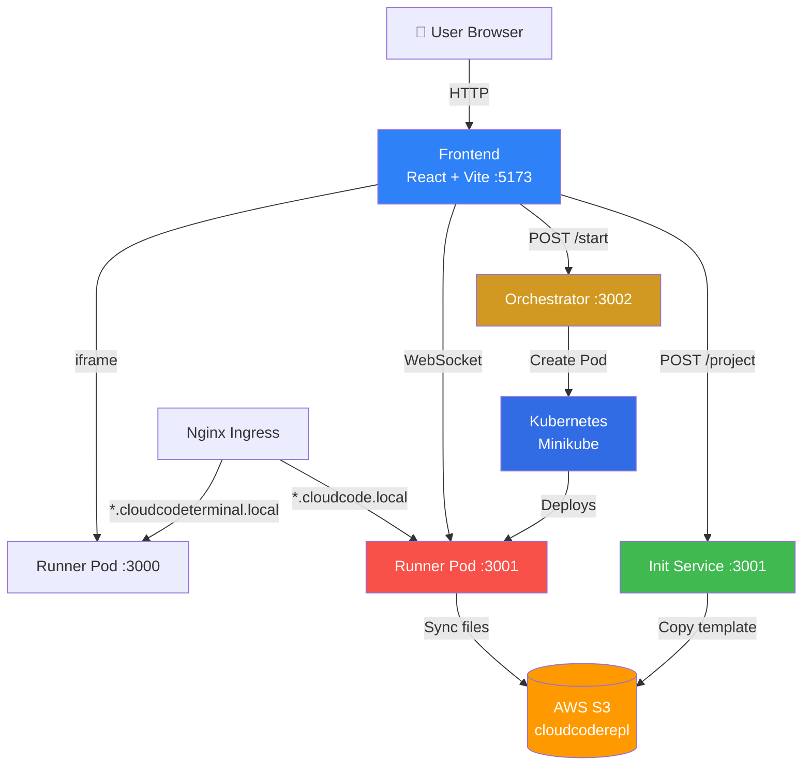
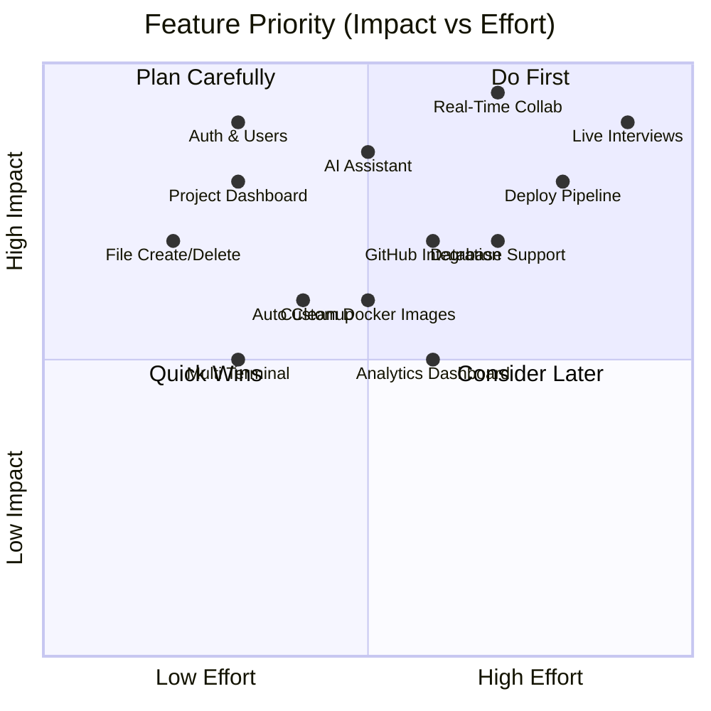

# CloudCode Platform — Full Analysis & Next-Level Roadmap

---

## Part 1: What You Have Today

### Architecture Overview

---

### Microservice Breakdown

#### 1. Frontend (React + Vite + TypeScript)

| Component | File | What It Does |
|---|---|---|
| Landing Page | [Landing.tsx](file:///m:/MOHAMMAD/Full%20Stack%20Develoment/Web%20Development/MERN/REPL/repl-main/Cloud%20Based%20code%20Execution/frontend/src/components/Landing.tsx) | Project name input, language selection (Node.js/Python), calls init-service |
| Coding Page | [CodingPage.tsx](file:///m:/MOHAMMAD/Full%20Stack%20Develoment/Web%20Development/MERN/REPL/repl-main/Cloud%20Based%20code%20Execution/frontend/src/components/CodingPage.tsx) | Main IDE layout — sidebar + editor + terminal/output panel |
| Code Editor | [Editor.tsx](file:///m:/MOHAMMAD/Full%20Stack%20Develoment/Web%20Development/MERN/REPL/repl-main/Cloud%20Based%20code%20Execution/frontend/src/components/Editor.tsx) | Monaco Editor wrapper (same engine as VS Code) |
| Terminal | [Terminal.tsx](file:///m:/MOHAMMAD/Full%20Stack%20Develoment/Web%20Development/MERN/REPL/repl-main/Cloud%20Based%20code%20Execution/frontend/src/components/Terminal.tsx) | Xterm.js terminal, streams data via WebSocket |
| Output Preview | [Output.tsx](file:///m:/MOHAMMAD/Full%20Stack%20Develoment/Web%20Development/MERN/REPL/repl-main/Cloud%20Based%20code%20Execution/frontend/src/components/Output.tsx) | iframe showing user's running app on port 3000 |
| File Tree | `external/editor/` | File explorer tree with folder expand/collapse |
| Router | [App.tsx](file:///m:/MOHAMMAD/Full%20Stack%20Develoment/Web%20Development/MERN/REPL/repl-main/Cloud%20Based%20code%20Execution/frontend/src/App.tsx) | 2 routes: `/` (Landing) and `/coding` (IDE) |

**Tech Stack**: React 18, Vite, TypeScript, Monaco Editor, Xterm.js, Socket.io-client, Emotion CSS, React Router, Axios

---

#### 2. Init Service (Express + AWS SDK)

| File | What It Does |
|---|---|
| [index.ts](file:///m:/MOHAMMAD/Full%20Stack%20Develoment/Web%20Development/MERN/REPL/repl-main/Cloud%20Based%20code%20Execution/init-service/src/index.ts) | `POST /project` — receives `{replId, language}`, copies S3 template |
| [aws.ts](file:///m:/MOHAMMAD/Full%20Stack%20Develoment/Web%20Development/MERN/REPL/repl-main/Cloud%20Based%20code%20Execution/init-service/src/aws.ts) | `copyS3Folder()` — copies `base/<language>/` → `code/<replId>/` in S3 |

**Flow**: User clicks "Create Repl" → Init Service copies template files from `base/node-js/` to `code/mohammad/` in S3.

---

#### 3. Orchestrator (Express + K8s Client)

| File | What It Does |
|---|---|
| [index.ts](file:///m:/MOHAMMAD/Full%20Stack%20Develoment/Web%20Development/MERN/REPL/repl-main/Cloud%20Based%20code%20Execution/orchestrator-simple/src/index.ts) | `POST /start` — reads service.yaml, replaces `service_name` → `replId`, deploys to K8s |
| [service.yaml](file:///m:/MOHAMMAD/Full%20Stack%20Develoment/Web%20Development/MERN/REPL/repl-main/Cloud%20Based%20code%20Execution/orchestrator-simple/service.yaml) | K8s template: Deployment + Service + Ingress per user pod |

**Creates 3 K8s resources per project**:
- **Deployment** — 1 replica of Runner image with S3 init container
- **Service** — ClusterIP exposing ports 3001 (WebSocket) and 3000 (user app)
- **Ingress** — Wildcard subdomain routing via nginx

---

#### 4. Runner (Runs Inside Each Pod)

| File | What It Does |
|---|---|
| [index.ts](file:///m:/MOHAMMAD/Full%20Stack%20Develoment/Web%20Development/MERN/REPL/repl-main/Cloud%20Based%20code%20Execution/runner/src/index.ts) | Express + Socket.io server on port 3001 |
| [ws.ts](file:///m:/MOHAMMAD/Full%20Stack%20Develoment/Web%20Development/MERN/REPL/repl-main/Cloud%20Based%20code%20Execution/runner/src/ws.ts) | WebSocket handlers: `fetchDir`, `fetchContent`, `updateContent`, `requestTerminal`, `terminalData` |
| [fs.ts](file:///m:/MOHAMMAD/Full%20Stack%20Develoment/Web%20Development/MERN/REPL/repl-main/Cloud%20Based%20code%20Execution/runner/src/fs.ts) | File system operations: read dir, read file, write file |
| [pty.ts](file:///m:/MOHAMMAD/Full%20Stack%20Develoment/Web%20Development/MERN/REPL/repl-main/Cloud%20Based%20code%20Execution/runner/src/pty.ts) | `node-pty` terminal management — creates bash shells per session |
| [aws.ts](file:///m:/MOHAMMAD/Full%20Stack%20Develoment/Web%20Development/MERN/REPL/repl-main/Cloud%20Based%20code%20Execution/runner/src/aws.ts) | `saveToS3()` — persists file changes back to S3 |
| [Dockerfile](file:///m:/MOHAMMAD/Full%20Stack%20Develoment/Web%20Development/MERN/REPL/repl-main/Cloud%20Based%20code%20Execution/runner/Dockerfile) | Node.js 20 + Python3 + pip base image |

---

### Current Capabilities ✅

| Feature | Status | Details |
|---|---|---|
| Create project | ✅ | Landing page with name + language |
| Container isolation | ✅ | Each project gets its own K8s pod |
| Code editor | ✅ | Monaco Editor (VS Code engine) |
| File explorer | ✅ | Tree view with folder navigation |
| Terminal | ✅ | Interactive bash via node-pty + Xterm.js |
| Live preview | ✅ | iframe showing port 3000 output |
| File persistence | ✅ | Auto-saves to AWS S3 on edit |
| Multi-language | ✅ | Node.js and Python templates |
| Dynamic routing | ✅ | Per-project subdomain via Nginx Ingress |
| Dual-domain security | ✅ | IDE and output on separate domains |

### Current Gaps ❌

| Gap | Impact |
|---|---|
| No authentication | Anyone can access any project |
| No project listing/dashboard | Can't see your past projects |
| No file create/delete/rename | Can only edit existing files |
| No auto-cleanup | Idle pods run forever, waste resources |
| No collaboration | Single user per project |
| No database | No user data persistence (only S3 for code) |
| No error handling UI | Errors only appear in console |
| Single language per project | Can't switch language after creation |
| No git integration | Can't push/pull from GitHub |

---

## Part 2: Next-Level Feature Roadmap

### 🏗️ Phase 1 — Foundation (Must-Have)
*Make it production-ready*

#### 1.1 Authentication & User System
- **JWT + Google/GitHub OAuth** login
- MongoDB/PostgreSQL for user profiles
- Each user sees only their projects
- **Why**: Without auth, it's a demo. With it, it's a product.

#### 1.2 Project Dashboard
- List all your projects with language badges, last edited time
- Delete / rename projects
- Search and filter projects
- **Why**: Users need a home base.

#### 1.3 File Operations (Create / Delete / Rename)
- Right-click context menu on file tree
- Create new files and folders
- Drag-and-drop file reordering
- **Why**: Currently you can only edit existing files — a major limitation.

#### 1.4 Auto-Cleanup (Pod Lifecycle Management)
- Idle timeout: auto-delete pods after 30min inactivity
- Heartbeat system via WebSocket
- "Your session expired" UI with restart button
- **Why**: Prevents resource exhaustion. Shows infrastructure maturity.

---

### 🚀 Phase 2 — Power Features
*Stand out from the crowd*

#### 2.1 Real-Time Collaboration (Google Docs for Code)
- **CRDT** (Conflict-free Replicated Data Types) using **Yjs** library
- Multiple cursors with user labels (like Google Docs)
- Share project via link
- Live presence indicators (who's online)
- **Tech**: Yjs + y-websocket + Monaco binding
- **Why**: This alone makes it a 10x project. Very few candidates build this.

#### 2.2 AI Coding Assistant
- Integrate **OpenAI/Gemini API** for in-editor code suggestions
- "Explain this code", "Fix this error", "Generate function"
- AI-powered terminal error explanations
- **Tech**: Gemini API + custom prompt engineering
- **Why**: AI is the hottest topic. Combining cloud IDE + AI = interview gold.

#### 2.3 Multiple Terminal Support
- Open multiple terminal tabs (like VS Code)
- Split terminal view
- Named terminals
- **Why**: Power users need multiple shells.

#### 2.4 Environment Variables Manager
- UI to set env vars per project
- Stored encrypted in database
- Injected into pod at startup
- **Why**: Real apps need env vars. Shows security awareness.

---

### ⚡ Phase 3 — Enterprise Features
*Make it look like a real product*

#### 3.1 GitHub Integration
- **Import**: Clone a GitHub repo into a project
- **Export**: Push code changes to GitHub
- OAuth with GitHub for auth + repo access
- **Why**: Bridges your IDE to real developer workflows.

#### 3.2 Custom Docker Images
- Let users pick from templates: React, Next.js, Django, Flask, Go, Rust
- Custom Dockerfile upload
- Pre-installed dependency caching
- **Why**: Shows deep Docker/K8s knowledge.

#### 3.3 Database Support
- One-click add PostgreSQL/MongoDB/Redis sidecar container to pod
- Connection string auto-injected as env var
- Database UI viewer
- **Tech**: K8s sidecar containers
- **Why**: Real apps need databases. This is a huge differentiator.

#### 3.4 Deployment Pipeline
- "Deploy" button that builds and pushes to a public URL
- Generate shareable preview links
- Build logs in real-time
- **Why**: Complete the developer lifecycle: Code → Run → Deploy.

---

### 🌟 Phase 4 — Wow Factor
*Features that blow interviewers' minds*

#### 4.1 Live Coding Interviews
- Interviewer creates a room, candidate joins
- Real-time code sync + video chat (WebRTC)
- Interviewer can see candidate's terminal
- Timer and problem statement panel
- **Why**: Shows you understand a real business use case.

#### 4.2 Project Templates Marketplace
- Community-contributed project starters
- Categories: Web, API, ML, CLI, Game
- One-click fork
- **Why**: Shows platform thinking.

#### 4.3 Usage Analytics Dashboard
- CPU/Memory usage per pod (Kubernetes metrics)
- Real-time Grafana-style charts
- Billing simulation (track compute hours)
- **Tech**: K8s Metrics Server + custom dashboard
- **Why**: Shows ops/observability skills.

#### 4.4 Plugin System
- Let users install VS Code extensions (themes, linters)
- Custom keybindings
- **Why**: Shows extensibility thinking.

---

## Priority Matrix

## Recommended Build Order

| Order | Feature | Time Estimate | Resume Impact |
|---|---|---|---|
| 1️⃣ | Auth + User System | 2-3 days | ⭐⭐⭐ |
| 2️⃣ | Project Dashboard | 1-2 days | ⭐⭐⭐ |
| 3️⃣ | File Create/Delete/Rename | 1 day | ⭐⭐ |
| 4️⃣ | Auto-Cleanup (Pod TTL) | 1 day | ⭐⭐⭐ |
| 5️⃣ | **Real-Time Collaboration** | 3-5 days | ⭐⭐⭐⭐⭐ |
| 6️⃣ | **AI Coding Assistant** | 2-3 days | ⭐⭐⭐⭐⭐ |
| 7️⃣ | GitHub Integration | 2-3 days | ⭐⭐⭐⭐ |
| 8️⃣ | Multiple Terminals | 1 day | ⭐⭐ |
| 9️⃣ | Database Sidecars | 2-3 days | ⭐⭐⭐⭐ |
| 🔟 | Deploy Pipeline | 3-4 days | ⭐⭐⭐⭐⭐ |

> [!TIP]
> **If you only build 2 more features**, build **Real-Time Collaboration** and **AI Assistant**. Those two alone will make interviewers' jaws drop.

> [!IMPORTANT]
> **Auth + Dashboard should come first** even though they're less exciting — they make everything else possible and make the app feel "real" instead of a demo.
